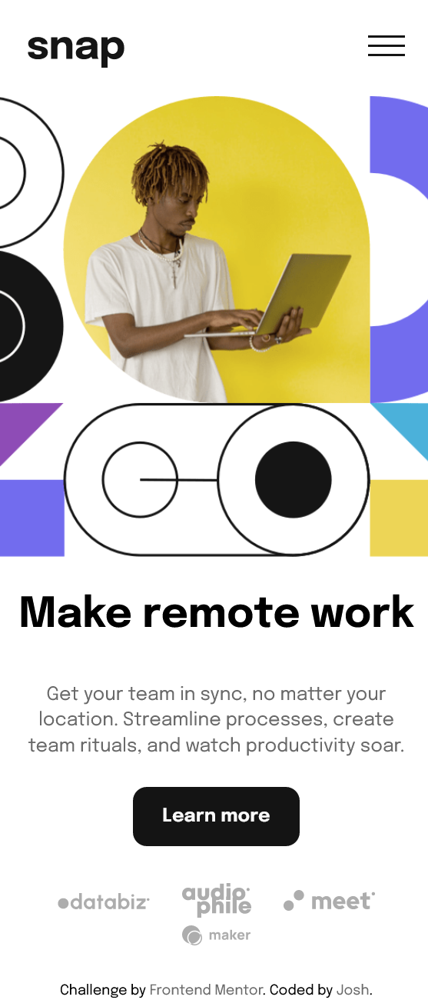
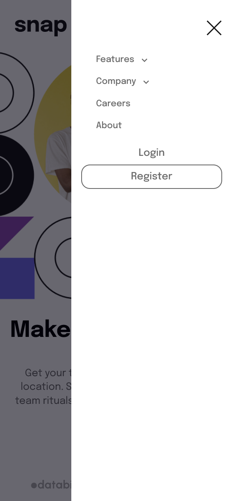
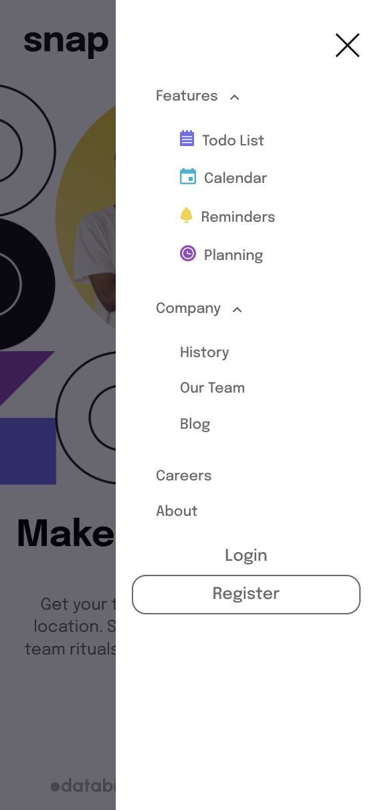

# Frontend Mentor - Intro section with dropdown navigation solution

This is a solution to the [Intro section with dropdown navigation challenge on Frontend Mentor](https://www.frontendmentor.io/challenges/intro-section-with-dropdown-navigation-ryaPetHE5). Frontend Mentor challenges help you improve your coding skills by building realistic projects.

## Table of contents

-   [Overview](#overview)
    -   [The challenge](#the-challenge)
    -   [Screenshot](#screenshot)
    -   [Links](#links)
-   [My process](#my-process)
    -   [Built with](#built-with)
    -   [What I learned](#what-i-learned)
    -   [Useful resources](#useful-resources)
-   [Author](#author)
-   [Acknowledgments](#acknowledgments)

## Overview

### The challenge

Users should be able to:

-   View the relevant dropdown menus on desktop and mobile when interacting with the navigation links
-   View the optimal layout for the content depending on their device's screen size
-   See hover states for all interactive elements on the page

### Screenshot






### Links

-   Solution URL: (https://github.com/Ao-chi/intro-section-with-dropdown-navigation-main.git)
-   Live Site URL: [Add live site URL here](https://your-live-site-url.com)

## My process

### Built with

-   Semantic HTML5 markup
-   SCSS
-   Flexbox
-   CSS Grid
-   Responsive Design
-   Javascript

### What I learned

The challenging part for me in this project was building the dropdown menu. Below are the styling and scripts I used for it to work jsut fine.

```css
.nav-items {
    position: relative;
    font-size: font-size(font-14);

    .dropdown-toggle {
        padding: 0;
        border: none;
        font-size: font-size(font-14);

        svg {
            transition: all 0.2s;
            transform: rotate(180deg);
        }
        &:not(.active) {
            svg {
                transform: rotate(0deg);
            }
        }
    }

    .dropdown-menu {
        position: absolute;
        top: 3rem;
        left: 1rem;
        @include display-flex(baseline, flex-start);
        flex-direction: column;
        height: auto;
        width: 100%;
        overflow: visible;
        @include visibility-hiddden($visible, $opacity-1);
        background: $text-white;
        border-radius: 10px;
        box-shadow: 0px 10px 40px rgb(0 0 0 / 15%);
        -webkit-box-shadow: 0px 10px 40px rgb(0 0 0 / 15%);
        -moz-box-shadow: 0px 10px 40px rgb(0 0 0 / 15%);
        padding: $p-1_5;
        padding-bottom: $p-1;
        transition: all 0.5s;

        &:not(.show) {
            height: 0;
            padding: 0 $p-1_5;
            overflow: hidden;
            @include visibility-hiddden($hidden, $opacity-0);
        }

        li {
            width: 100%;
            .dropdown-item {
                padding-bottom: $p-0_5;
            }
        }
    }

    .features {
        top: 3rem;
        left: -3rem;
        width: 9.5rem;
        .dropdown-item {
            @include display-flex(center, flex-start);
            padding-bottom: $p-0_5;

            .drp-icon {
                margin-left: $p-0 !important;
                margin-right: $p-0_5;
            }
        }
    }
    @include breakpoint(md, max) {
        .dropdown-toggle {
            span {
                margin-left: $p-0_5;
            }
        }

        .dropdown-menu {
            position: relative;
            top: 0;
            right: 0;
            left: 0;
            box-shadow: none;
            padding-bottom: $p-0;
            li {
                .dropdown-item {
                    padding-bottom: $p-1;
                }
            }
        }
    }
}
```

```js
//dropdown toggle
let dropdownBtn = document.querySelectorAll(".dropdown-toggle");
let arrowIcon = document.querySelectorAll('.dropdown-toggle[aria-expanded="false"]');

for (let i = 0; i < dropdownBtn.length; i++) {
    const drop = dropdownBtn[i];
    dropdownBtn[i].addEventListener("click", function () {
        console.log("clicked");

        let drpMenu = this.nextElementSibling;
        drpMenu.classList.toggle("show");
        dropdownBtn[i].classList.toggle("active");

        if (dropdownBtn[i].classList.contains("active")) {
            dropdownBtn[i].setAttribute("aria-expanded", "true");
        } else {
            dropdownBtn[i].setAttribute("aria-expanded", "true");
        }
    });
}
```

### Useful resources

-   (https://getbootstrap.com/docs/5.0/components/dropdowns/) - I tried to pattern my dropdown markup on how Bootstrap do theirs'.

## Author

-   Frontend Mentor - [@Ao-chi](https://www.frontendmentor.io/profile/Ao-chi)

## Acknowledgments

Thanks to all whom I got my inspirations in building and completing this project!
